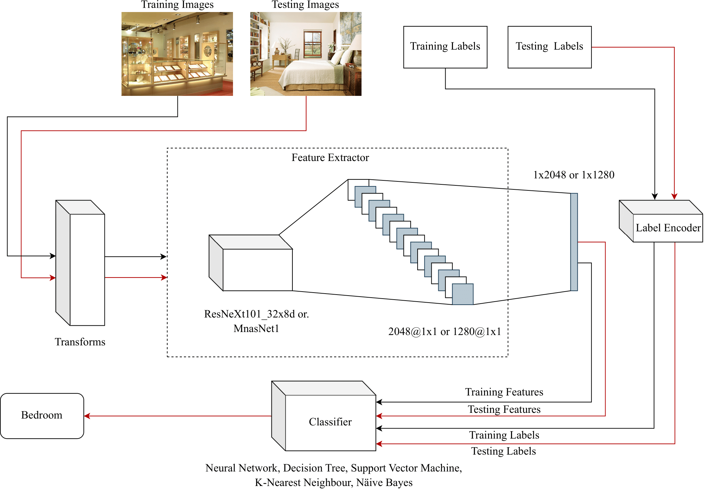

# An embarrassingly simple comparison of machine learning algorithms for indoor scene classification

This is a python implementation of an indoor scene classifier comparison with experimentation results.

## Method


## Usage

### Prerequisite

Install the dependencies using the `requirements.txt` file.

### Setting up the code

There are two ways of setting up the code.
1. Extracting features from the dataset to train and test the classifiers.
2. Using the extracted features to train and test the classifiers.

#### Extracting the features from the dataset

Let ```ROOT``` be the directory where all data/code/results will be placed.

1. Download the indoor scene classification dataset [using this link](http://groups.csail.mit.edu/vision/LabelMe/NewImages/indoorCVPR_09.tar) and place all class folders in ```${ROOT}/Images/airport_inside``` etc.

2. Download the train labels [using this link](http://web.mit.edu/torralba/www/TrainImages.txt) and test labels [using this link](http://web.mit.edu/torralba/www/TestImages.txt) and place them in ```${ROOT}/Dataset/TrainImages.txt``` and ```${ROOT}/Dataset/TestImages.txt```.

3. Execute the feature extraction script using `python feature_extractor.py`. This will create the `mnasnet1_0-features.h5` and `resnext101-features.h5` in your ```${ROOT}/Dataset/``` folder.


#### Using the extracted features

Let ```ROOT``` be the directory where all data/code/results will be placed.

1. Download the extracted features [using this link](https://www.dropbox.com/s/ggvg9koenjk6n2g/Features.zip?dl=0) and place them in `${ROOT}/Dataset/mnasnet1_0-features.h5` and `${ROOT}/Dataset/resnext101-features.h5`.

2. Download the train labels [using this link](http://web.mit.edu/torralba/www/TrainImages.txt) and test labels [using this link](http://web.mit.edu/torralba/www/TestImages.txt) and place them in ```${ROOT}/Dataset/TrainImages.txt``` and ```${ROOT}/Dataset/TestImages.txt```.

### Running the scripts

#### Training and Generating the results

Execute `python train_all.py`. Note: This may take more than 48 hours based on the specs of the PC.

#### Extracting the results from the logs

Execute `python extract_results.py > results/results.txt`. 

This will create a csv file in ```${ROOT}/results/results.csv``` and a text file ```${ROOT}/results/results.txt``` with a LaTeX table with selected columns. 

You can modify this by updating the columns [in this line](https://github.com/bhanukaManesha/embarrassingly-simple-classifier-comparison/blob/91f0724e34bb0a2bf0b8d7c65e66a83c26812b57/extract_results.py#L126).

#### Plotting

Execute `python plot.py`.

This will generate all the plots in the ```${ROOT}/plots/``` folder.


## Results

All the experiment results can be downloaded [using this link](https://www.dropbox.com/s/x71v12o9t482ziz/Results.zip?dl=0).
